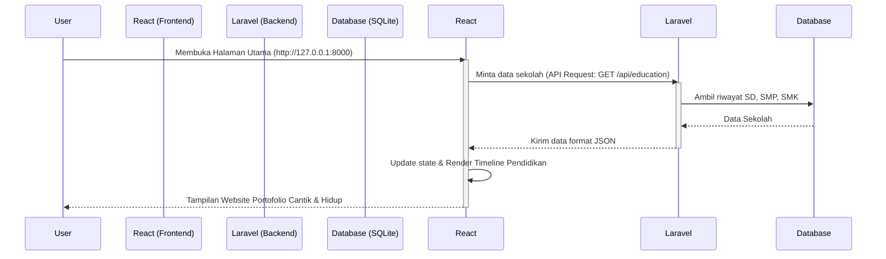

# Panduan & Penjelasan Lengkap Pembuatan Web Profile Naufal 🌊

Dokumen ini menjelaskan arsitektur, sejarah perbaikan, struktur folder yang rapi, penjelasan kode, serta alur kerja dari website portofolio bertema **Lautan (Ocean Theme)** milik **Maulana Naufal Fatihus Sururi**.

---

## 1. Kronologi Pembuatan & Pemecahan Masalah Awal

Ketika pertama kali dijalankan, website mengalami error **500 Internal Server Error** dengan pesan:
> `Database file at path [C:\WebProfileNaufal-17-13.x\database\database.sqlite] does not exist.`

### Solusi yang Dilakukan:
1. **Membuat database SQLite kosong**: Membuat file fisik `database.sqlite` di dalam folder `database/` secara otomatis.
2. **Menjalankan Migrasi**: Menggunakan perintah `php artisan migrate` untuk menginisialisasi tabel-tabel bawaan Laravel (seperti `users`, `sessions`, `jobs`, `cache`) agar sistem siap digunakan.

---

## 2. Struktur Folder Hasil Kerapian (Refactoring)

Untuk menghindari penumpukan kode dalam satu file besar (monolitik), file-file telah dipisah secara rapi menjadi struktur **Backend** dan **Frontend** yang modular:

### Struktur File Utama:
```
c:\WebProfileNaufal-17-13.x\
├── app/
│   └── Http/
│       └── Controllers/
│           ├── Controller.php         # Controller Utama
│           └── Api/
│               └── EducationController.php  # [BACKEND] Mengirim data pendidikan
├── database/
│   └── database.sqlite                # Database lokal SQLite
├── resources/
│   ├── css/
│   │   └── app.css                    # Seluruh gaya visual & animasi tema laut
│   └── js/
│       ├── app.js
│       ├── app.jsx                    # Inisialisasi React ke Blade
│       └── components/
│           ├── ProfileApp.jsx         # [ORCHESTRATOR] Menggabungkan semua bagian
│           ├── layout/
│           │   ├── Navbar.jsx         # Menu navigasi sticky
│           │   └── BackgroundEffects.jsx  # Efek ubur-ubur, ombak, gelembung air
│           └── sections/
│               ├── HeroSection.jsx    # Sambutan, foto profil & glow efek
│               ├── AboutSection.jsx   # Info biodata, tanggal & tempat lahir
│               ├── EducationSection.jsx # Garis waktu (Timeline) Pendidikan dari API
│               ├── SkillsSection.jsx  # Daftar skill teknis & kreatif
│               ├── ProjectsSection.jsx # Portofolio proyek kecil
│               └── ContactFooter.jsx  # Link sosial media & footer
└── routes/
    └── web.php                        # Rute web dan endpoint API backend
```

---

## 3. Penjelasan Detail Fungsi Setiap Kode

### A. Sisi Backend (Laravel)

#### 1. Rute Aplikasi (`routes/web.php`)
Menentukan URL mana saja yang bisa diakses oleh pengunjung atau dipanggil oleh JavaScript.
* **`Route::get('/', ...)`**: Mengarahkan halaman utama website ke template Blade (`welcome.blade.php`) tempat React di-mount.
* **`Route::get('/api/education', ...)`**: Jalur khusus API (endpoint) yang akan diakses oleh frontend React untuk mengambil data riwayat sekolah dalam format JSON.

#### 2. Controller Pendidikan (`app/Http/Controllers/Api/EducationController.php`)
* **`class EducationController extends Controller`**: Bertugas mengemas data pendidikan SD, SMP, dan SMK secara dinamis.
* **`index()`**: Method yang mengembalikan response JSON berisi data terstruktur:
  - **SD (MINU KH Mukmin Sidoarjo)**
  - **SMP (MTsN 1 Sidoarjo)** beserta deskripsi pendalaman ilmu umum & agama.
  - **SMK (SMKN 2 Buduran Sidoarjo)** dengan status kejuruan.
  - Setiap data memiliki tag **icon** (seperti `'book'`, `'compass'`, atau `'code'`) untuk menentukan ikon visual yang muncul di React.

---

### B. Sisi Frontend (React.js)

#### 1. Main Entrypoint (`resources/js/app.jsx`)
* Menghubungkan library React dengan HTML (DOM) pada element `<div id="app"></div>` di file Blade.
* Merender component utama `<ProfileApp />`.

#### 2. Komponen Pengatur Utama (`components/ProfileApp.jsx`)
Fungsinya sebagai konduktor/orkestrator yang menggabungkan seluruh layout dan seksi halaman.
* **State Management**:
  - `scrolled`: Status apakah user telah men-scroll halaman ke bawah > 80px (dipakai untuk mengubah tampilan Navbar menjadi transparan/blur kaca).
  - `education`: Menyimpan data array pendidikan yang didapat dari Backend API.
  - `activeEdu`: Menandai kartu pendidikan mana yang sedang disentuh kursor (hover) untuk memicu animasi menyala (glow).
* **`useEffect` Hook**:
  - Memasang pendengar scroll (`handleScroll`) untuk memicu efek **reveal animation** (membuat konten muncul perlahan ketika di-scroll ke bawah).
  - Memasang pendengar gerakan mouse (`handleMouseMove`) agar efek sinar lampu di latar belakang mengikuti kursor user.
  - Mengambil data pendidikan dari backend menggunakan **`fetch('/api/education')`**.

#### 3. Navigasi (`components/layout/Navbar.jsx`)
* Menampilkan logo **Naufal.** dan link navigasi.
* Menerima fungsi `scrollTo` untuk membuat efek transisi scroll halus saat menu di-klik.

#### 4. Atmosfer & Efek (`components/layout/BackgroundEffects.jsx`)
Membuat tema **Ocean** terasa hidup melalui manipulasi CSS murni:
* **`bg-bubbles`**: Animasi gelembung sabun/air yang naik perlahan dari bawah ke atas.
* **`water-splashes` & `water-ripples`**: Efek rintik dan riak air laut di latar belakang.
* **`god-rays`**: Cahaya matahari yang menembus kedalaman air laut dari atas.
* **`jellyfish-container`**: Tiga ubur-ubur buatan dengan animasi tubuh berdenyut (`jellyfishPulse`) dan tentakel yang melambai (`tentacleWave`).
* **`ocean-waves`**: Dua gelombang air bergerak lambat di bagian paling bawah halaman menggunakan elemen SVG.

#### 5. Hero (`components/sections/HeroSection.jsx`)
* Menampilkan nama, status belajar, ringkasan singkat, tombol "Lihat Karya Saya", dan badge lokasi Surabaya.
* Foto profil diletakkan dalam lingkaran berputar (`spinGlow`) dengan gradasi cahaya biru toska neon.

#### 6. Tentang Saya (`components/sections/AboutSection.jsx`)
* **Badges Biodata**: Menampilkan informasi terformat berisi ikon dan teks tebal untuk **Tempat Lahir (Surabaya)** dan **Tanggal Lahir (10 Agustus 2009)**.
* Menggunakan pemisah paragraf yang rapi agar kalimat perkenalan, kisah perjalanan 9 bulan terakhir, dan hobi menulis cerita pendek terbaca dengan nyaman.

#### 7. Riwayat Pendidikan (`components/sections/EducationSection.jsx`)
* Merender data dari API database ke dalam bentuk **Garis Waktu (Vertical Timeline)**.
* Menampilkan ikon dinamis berdasarkan respon database (SD = Buku, SMP = Kompas, SMK = Baris Kode).
* Kartu dilengkapi efek interaktif dot bersinar yang membesar jika kursor diarahkan ke kartu tersebut.

#### 8. Skill & Proyek (`components/sections/SkillsSection.jsx` & `ProjectsSection.jsx`)
* Menyajikan pengelompokan keahlian teknis (HTML, CSS, JS, React, Laravel) dan kreatif (Canva, UI/UX, Menulis Cerita).
* Menampilkan 3 kartu proyek mini yang dilapisi kaca semi-transparan (glassmorphism).

#### 9. Footer & Kontak (`components/sections/ContactFooter.jsx`)
* Menampung tombol sosial media (Email, Instagram, TikTok, GitHub) dengan hover efek menyala biru laut dan informasi hak cipta tahunan dinamis (`new Date().getFullYear()`).

---

### C. Desain & Animasi (`resources/css/app.css`)

Website dirancang dengan prinsip **Aesthetics & Premium feel** menggunakan standard modern:
* **CSS Variables**: Mengatur palet warna laut (turquoise neon `#00E5FF`, ocean mid `#013A63`, ocean deep `#001220`).
* **Glassmorphism**: Lapisan panel transparan menggunakan `background: rgba(255, 255, 255, 0.05)` dipadukan dengan efek buram di belakangnya `backdrop-filter: blur(16px)` dan garis luar halus.
* **Keyframes Animasi**:
  - `floatUp`: Menerbangkan gelembung air secara acak.
  - `jellyfishFloat`: Mengapungkan ubur-ubur dari bawah ke atas layar.
  - `rayShimmer`: Efek kerlipan cahaya di dalam air.
  - `fadeInUp`: Mengangkat kartu pendidikan perlahan ke atas saat halaman dimuat.

---

## 4. Alur Kerja (Bagaimana Frontend & Backend Terkoneksi)


